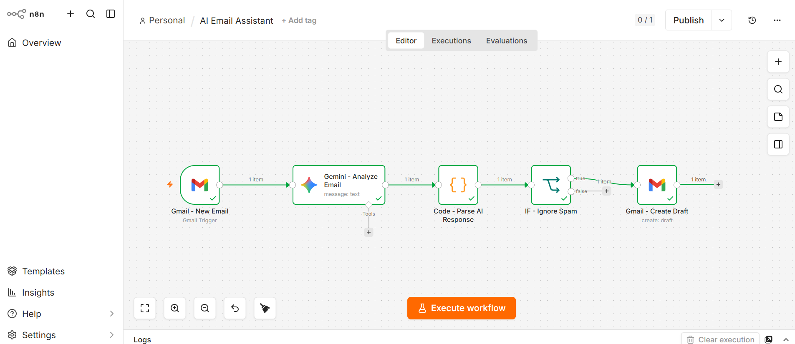
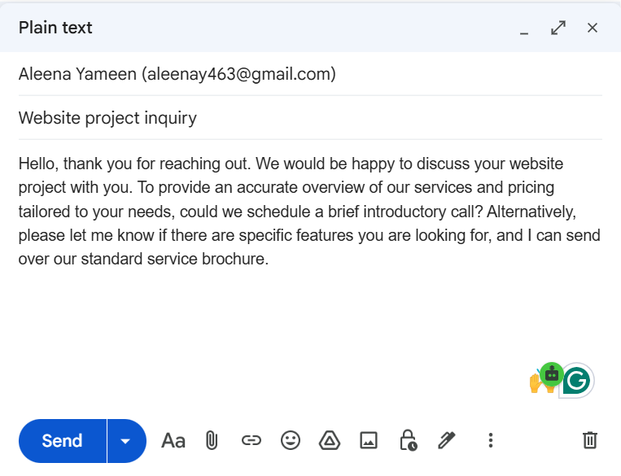

# 🤖 AI Email Assistant

An AI-powered email automation workflow built with n8n, Gmail, and Google Gemini.

The automation monitors incoming Gmail messages, analyzes them with Gemini, categorizes them, determines urgency, and generates professional draft replies.

## 🚀 Features

- 📩 Detects incoming Gmail messages
- 🤖 Analyzes emails using Google Gemini
- 🏷️ Categorizes emails
- 🚦 Determines email urgency
- ✍️ Generates professional replies
- 🚫 Filters spam emails
- 📝 Creates Gmail drafts instead of automatically sending emails
- 🔀 Uses conditional workflow logic
- ⚙️ Parses AI output into structured JSON

## 🧠 Workflow



```text
Gmail - New Email
        ↓
Gemini - Analyze Email
        ↓
Code - Parse AI Response
        ↓
IF - Ignore Spam
        ↓
Gmail - Create Draft
```

🔄 How It Works

1. Gmail Trigger

The workflow starts when a new email is received.

2. Gemini AI

Google Gemini analyzes the email and returns:

Summary
Category
Urgency
Suggested reply

3. Code Node

The AI's JSON response is parsed into separate fields:

{
  "summary": "...",
  "category": "...",
  "urgency": "...",
  "reply": "..."
}
4. Spam Filter

An IF node checks the category.

Spam emails are ignored.

Other emails continue to the draft stage.

5. Gmail Draft


The generated response is saved as a Gmail draft.

The workflow does NOT automatically send emails.

This allows the user to review the AI-generated response before sending it.

🛠️ Tech Stack
n8n
Gmail
Google Gemini API
JavaScript
JSON

🔐 Security

API keys, OAuth credentials, access tokens, and private email information are not included in this repository.

To use the workflow, configure your own Gmail OAuth credentials and Gemini API key inside n8n.

⚠️ Important

This project is intended as an automation/learning project.

AI-generated replies should be reviewed before being sent.

📌 Future Improvements
Retrieve and process the complete email body
Add urgency-based notifications
Automatically label emails
Add Google Calendar integration
Add human approval before sending
Support HTML email formatting
Add logging and error handling
Add automatic follow-up reminders

👩‍💻 Author

Aleena Yameen

Built as a practical AI automation project using n8n, Gmail, and Google Gemini.